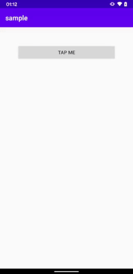

# KeyboardStateEvents
[](https://android-arsenal.com/details/1/8092)

Get notified through LiveData when Keyboard is open or closed

## Installation

ResourcesProvider-ktx is distributed through [Maven Central](https://search.maven.org/artifact/com.github.guilhe/keyboard-state-events), [Jcenter](https://bintray.com/gdelgado/android/KeyboardStateEvents) and [Jitpack](https://jitpack.io/#GuilhE/KeyboardStateEvents).

```groovy
implementation 'com.github.guilhe:keyboard-state-events:${LATEST_VERSION}'
```
[](https://search.maven.org/search?q=g:com.github.guilhe%20AND%20keyboard-state-events) [](https://bintray.com/gdelgado/android/KeyboardStateEvents/_latestVersion) 

## Usage

Call `bindKeyboardStateEvents()` in you `AppCompatActivity` or `FragmentActivity` and observe `KeyboardLiveData.state` to get notified:
```java
class MainActivity : AppCompatActivity() {

    override fun onCreate(savedInstanceState: Bundle?) {
        super.onCreate(savedInstanceState)
        ...
        KeyboardLiveData.state.observe(this, Observer {...})
        bindKeyboardStateEvents()
    }
}
```
Just that and you're done! 😎

Also, some handy extension functions:  
```java
ComponentActivity.toggleKeyboard()
ComponentActivity.dismissKeyboard()
ComponentActivity.isKeyboardOpen()
ViewGroup.isKeyboardOpen()
```


    
## Dependencies
- [androidx.lifecycle:lifecycle-livedata-ktx](https://developer.android.com/jetpack/androidx/releases/lifecycle)
- [androidx.activity:activity-ktx](https://developer.android.com/jetpack/androidx/releases/activity)


## Bugs and Feedback

For bugs, questions and discussions please use the [Github Issues](https://github.com/GuilhE/KeyboardStateEvents/issues).

## LICENSE

Copyright (c) 2020-present GuilhE

Licensed under the Apache License, Version 2.0 (the "License");
you may not use this file except in compliance with the License.
You may obtain a copy of the License at

<http://www.apache.org/licenses/LICENSE-2.0>

Unless required by applicable law or agreed to in writing, software
distributed under the License is distributed on an "AS IS" BASIS,
WITHOUT WARRANTIES OR CONDITIONS OF ANY KIND, either express or implied.
See the License for the specific language governing permissions and
limitations under the License.
